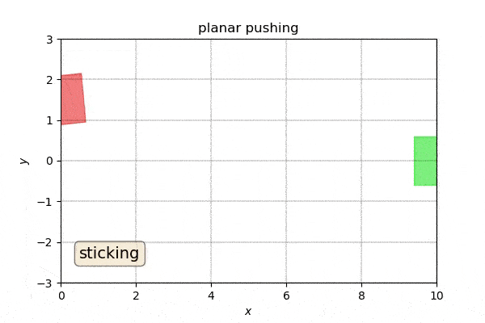

# Random Trees of Polytopes for Approximate Optimal Control of Piecewise Affine Systems
## Sadra Sadraddini and Russ Tedrake
### [Robot Locomotion Group](http://groups.csail.mit.edu/locomotion/), MIT CSAIL


### Abstract
Piecewise affine (PWA) systems are widely used to model highly nonlinear behaviors such as contact dynamics in robot locomotion and manipulation. Existing control techniques for PWA systems have computational drawbacks, both in offline design and online implementation. 
In this paper, we introduce a method to obtain feedback control policies and a corresponding  set of admissible initial conditions for discrete-time PWA systems such that all the closed-loop trajectories reach a goal polytope, while a cost function is optimized. 
The idea is conceptually similar to LQR-trees [Tedrake et. al. (2010)](https://groups.csail.mit.edu/robotics-center/public_papers/Tedrake10.pdf), which consists of 3 steps: (1) open-loop trajectory optimization, (2) feedback control for computation of "funnels" of states around trajectories, and (3) repeating (1) and (2) in a way that the funnels are grown backward from the goal in a tree fashion and fill the state-space as much as possible. We show PWA dynamics can be exploited to combine step (1) and (2) into a single step that is tackled using mixed-integer convex programming, which makes the method more suitable for dealing with hard constraints. Illustrative examples on contact-based dynamics are presented. 

### ArXiv Paper
The extended version (corrections made) is available in [ArXiv](https://arxiv.org/pdf/1809.09716.pdf)

Also check the video below that summarizes the method.

[](http://www.youtube.com/watch?v=gGH0EuIzkgY "Polytopic Trees")


### Dependencies:
* [Gurobi](http://www.gurobi.com/) Version 7.0 or later. Free Academic use.

### Folder Descriptions
* Main: source code of methods
* Convex_Hull (*new*): methods related to disjuctive programming for faster tree extention 
* Examples: 
    * Bouncing ball 
    * Inverted pendulum with wall, Example 1 in [Marcucci et al. 2017](http://groups.csail.mit.edu/robotics-center/public_papers/Marcucci17.pdf)
    * Inverted pendulum with two walls - one on each side
    * Stablizing 4-cell PWA system: Example 2 in [Rakovic et al. 2004](https://www.researchgate.net/profile/Michal_Kvasnica/publication/4143171_Computation_of_invariant_sets_for_piecewise_affine_discrete_time_systems_subject_to_bounded_disturbances/links/54d0b5930cf298d65668244c/Computation-of-invariant-sets-for-piecewise-affine-discrete-time-systems-subject-to-bounded-disturbances.pdf)
    * Hybrid stabilization of Planar Pushing 
    * Carrot flipping (*Under Progress*)
    * Autonomous Intersection (*Under Progress*)
    

## How to use guide:
The user may use the following to formulate a PWA control problem and obtain a controller. The following guide is the general picture, and it does not include minor details. The reader is encouraged to check the examples. 

### Step I: define the PWA system

Specify the modes, the valuations for affine dynamics in each mode, and the half-space representation of the polytope corresponding to it. 
So far, we have only considered cases where PWA cells are constructed in state space, not joint state-control space. Also, the user is asked to provide the bounding box of each PWA cell, which is used for sampling.

For example, a system can be defined in this way:
```
s=system(2,1,name="inverted pendulum with wall")
s.modes=[0,1]
```
We then define the matrices:
```
# A matrices
s.A[0]=np.array([[1,0.01],[0.1,1]])
s.A[1]=np.array([[1,0.01],[-9.9,1]])
# B Matrices
s.B[0]=np.array([[0,0.01]]).T
s.B[1]=np.array([[0,0.01]]).T
# c vectors
s.c[0]=np.array([[0,0]]).T
s.c[1]=np.array([[0,1]]).T
# H matrices (state cells)
s.H[0]=np.array([[1,0],[0,1],[-1,0],[0,-1]])
s.h[0]=np.array([[0.1,1,0.12,1]]).T   
s.H[1]=np.array([[1,0],[0,1],[-1,0],[0,-1]])
s.h[1]=np.array([[0.12,1,-0.1,1]]).T  
# F matrices (control cells)
s.F[0]=np.array([[1,-1]]).T
s.f[0]=np.array([[4,4]]).T
s.F[1]=np.array([[1,-1]]).T
s.f[1]=np.array([[4,4]]).T
```
We still need some tweaks (full explanation later, do not change this for better performance)
```
s.mode_polytope={}
for mode in s.modes:
    p=polytope(s.H[mode],s.h[mode])
    p.anchor=anchor_point(p)
    s.mode_polytope[mode]=p
s.weight={}
s.weight[0]=100/12
s.weight[1]=1
```

### Step II: Define a goal polytope
The problem is designing a control policy to get into the goal. The user may also define a cost function. The default is time optimality. 


Finally, we define the goal region, which is a box inside 
```
s.goal=state(np.array([0,0]).reshape(2,1),np.array([[0.,0],[0,0.0]]),0,0,0,10)
```

### Step III: run the polytope tree algorithm
The tree grows incrementally, and it may take a long time such that polytopes cover a large of portion of the state space. You can stop the algorithm at anytime.
The solution is still valid. See [anytime algorithm](https://en.wikipedia.org/wiki/Anytime_algorithm) on wiki. 

```
s.library={}
Tmax=20
for T in range(1,Tmax+1):
    print(T)
    trajectory_model(s,T)
intitialize_tree(s,T=Tmax ,alpha_start=0)
Random_Tree_of_Polytopes(s,T_max=Tmax,eps_max=0.1)
```

### Step IV: Implementing the controllers
Two controllers are obtained:
    * The first controller is simple. It is based on matrix multiplications and is essentially an affine feedback in each polytope. It does not work properly for states out of the tree. 
    * The second controller solves a small convex program to keep the system within the tree, or close to the tree, while decreasing the value function. This controller can handle states outside of the tree, but does not provide any guarantee that the state gets into the goal- unless the state falls into the tree.
Explanation of details to come.

### Visualization
Current version only supports visualization for 2D problems. For higher dimensions, projections to 2D are performed. See examples. 

### Contact us
If you have any questions regarding this work, or you are willing to contribute, please contact [Sadra Sadraddini](mailto:sadra@mit.edu) 

Last updated on Dec 10, 2018.
